# ElectionSentiments

## Contents

1. [Introduction](#introduction)
2. [Background](#background)
3. [Solution Overview](#solution-overview)
   - [Data Pipeline](#data-pipeline)
   - [Data Schema](#data-schema)
4. [Setup](#setup)
   - [Tools and Technologies](#tools-and-technologies)
   - [Prerequisites](#prerequisites)
   - [Setup Instructions](#setup-instructions)
5. [Conclusion](#conclusion)

## Problem Statement

In the dynamic and data-rich landscape of the 2024 U.S. elections, our project stands at the convergence of technology and political science, harnessing the vast streams of digital discourse across Twitter, Reddit, and various news platforms. There are a lot of opinions on the internet surrounding the election, and it is challenging to have a comprehensive understanding of these public views. Through advanced sentiment analysis techniques, we aim to decode the public sentiment surrounding the elections, providing real-time insights into voter behavior, preferences, and the socio-political climate.

## Background

Our primary objective is to leverage sentiment analysis to paint a comprehensive picture of the electoral landscape. By analyzing the tone, context, and frequency of discussions related to the 2024 U.S. elections, we aim to identify emerging trends, public opinions, and potential shifts in voter sentiment. This facilitates investors and businesses in anticipating the market reactions influenced by the political climate and varying electoral outcomes. Additionally, our insights can help political analysts, journalists, and policymakers in understanding the public's pulse, thereby informing their strategies and decisions.

## Solution

We propose a comprehensive solution that integrates data collection, processing, analysis and visualizations to provide near real-time insights into the public sentiment surrounding the 2024 U.S. elections.

### Data Pipeline

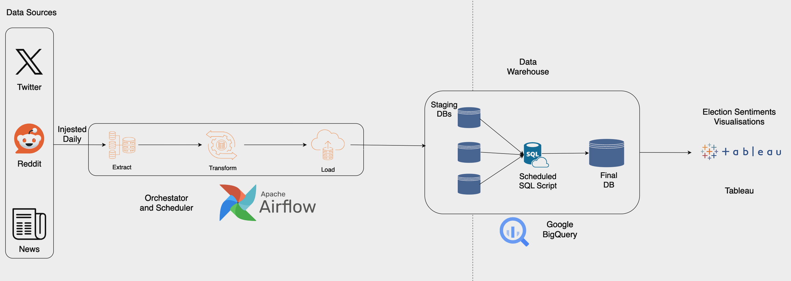

Components of our data pipeline include:

1. **Data Collection**: We collect data from Twitter, Reddit, and news platforms using APIs and web scraping techniques.
2. **Data Preprocessing**: We preprocess the collected data by cleaning, filtering, and transforming it into a structured format.
3. **Sentiment Analysis**: We perform sentiment analysis on the preprocessed data to classify the sentiment as positive, negative, or neutral.
4. **Data Storage**: We store the processed data in a data warehouse for further analysis and visualization.
5. **Data Visualization**: We visualize the sentiment analysis results using interactive dashboards and reports.

### Data Schema

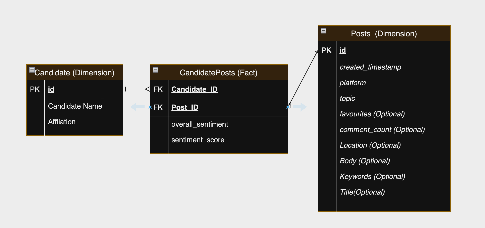

Following a Star Schema (Fact and Dimension Tables) for our data warehouse:

1. **CandidatePosts Table**: Contains the sentiment analysis results along with the source and timestamp.
2. **Candidate Table**: Contains information about the candidates, including their names and party affiliations.
3. **Source Table**: Contains information about the sources of the posts, such as Twitter, Reddit, and news platforms.

## Setup

### Tools and Technologies

To achieve our objectives, we will be using the following tools and technologies:

1. **Airflow**: For orchestrating the data pipeline and automating the workflow.
2. **Docker**: For local development of the Airflow environment.
3. **BigQuery**: For storing and querying the processed data.
4. **Tableau**: For visualizing the sentiment analysis results.
5. **twikit**: For collecting data from Twitter.
6. **PRAW**: For collecting data from Reddit.
7. **NYT API**: For collecting data from The New York Times.

### Prerequisites

Before starting, ensure the following requirements are met:

- Docker is installed and running on your machine.
- Docker Compose is available for orchestrating the Airflow containers.
- BigQuery is set up with the necessary permissions.
- Twitter Account
- PRAW Credentials
- NYT API Key

### Setup Instructions

Follow these steps to get your Airflow environment up and running:

#### Step 1: Initialize Environment Variables

Start by setting up the necessary environment variables in an `.env` file. This step ensures that the Docker containers run with the appropriate permissions.

Open a terminal in your project's root directory and execute:

```bash
echo -e "AIRFLOW_UID=$(id -u)" > .env

```

#### Step 2: Create secrets.json

Airflow needs access to certain secrets, like API keys or database credentials, to execute your workflows. Store these secrets in a secrets.json file.

Create a new file named secrets.json in the airflow directory

Populate secrets.json with your secrets, formatted as key-value pairs in JSON.

```json
{
{
  "TWITTER_USERNAME": "",
  "TWITTER_EMAIL": "",
  "TWITTER_PASSWORD": "",
  "NEWS_API_KEY": "",
  "REDDIT_CLIENT_ID": "",
  "REDDIT_CLIENT_SECRET": "",
  "REDDIT_USER_AGENT": ""
}

}
```

#### Step 3: Launch Airflow

With the .env file configured and your secrets safely stored in secrets.json, you are now ready to launch the Airflow environment. Use Docker Compose to manage the setup and ensure all services are started correctly.

Navigate to your project's root directory in a terminal and execute:

```bash
docker-compose down && docker-compose up --build -d
```

#### Step 4: Access Airflow UI

Once the services are up and running, you can access the Airflow UI by visiting http://localhost:8080 in your web browser. Use the credentials `airflow:airflow` to log in. (Unless you have initialized a different username and password in the .env file)

#### Step 5: Add Google Cloud Connection

Retrieve your BigQuery Keyfile JSON by following the instructions [here](https://docs.aws.amazon.com/dms/latest/sbs/bigquery-redshift-migration-step-1.html).
Once you have the keyfile, add a new connection in Airflow with the following details:

- Conn Id: `google_cloud_default`
- Conn Type: `Google Cloud`
- keyfile json: Paste the contents of the keyfile JSON

#### Step 6: Trigger the DAG

You should see these 3 dags in the Airflow UI:

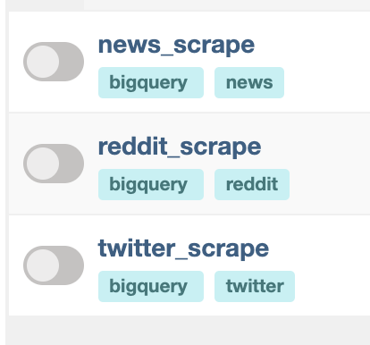.

Unpause the dags and these dags will run daily

#### Step 7: Configure scheudled SQL script

The above DAG will load the data into staging BigQuery Tables. To move them to our final/prod tables, you can add a scheduled [SQL script](ingestion_sql.sql) in BigQuery to run daily.
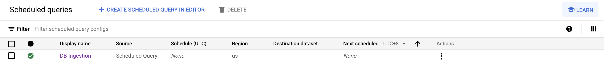.

#### Step 8: Configure your tableau to show the necessary visualizations

Connect your tableau to BigQuery and create the necessary visualizations.

## Conclusion

After pulling about 6000+ posts, we were able to get the following visualizations and insights:
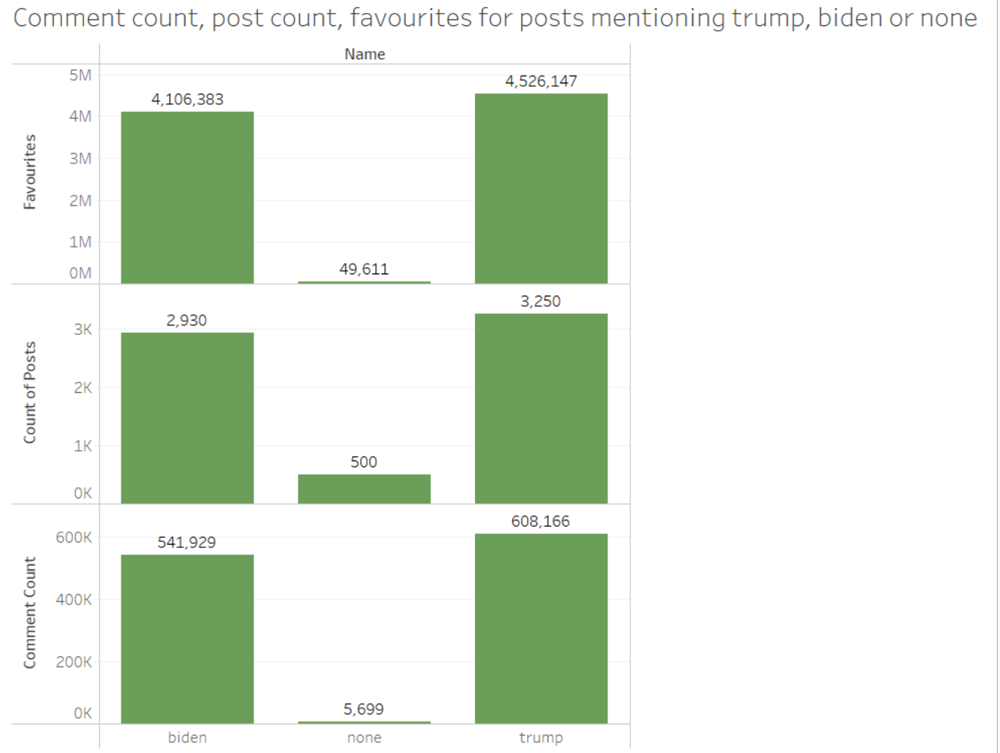
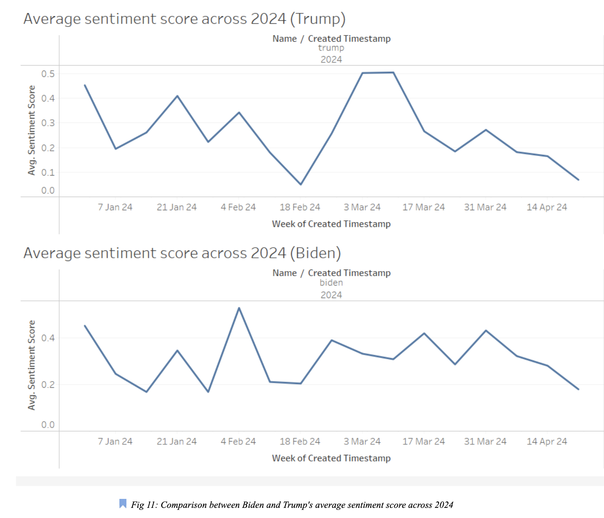
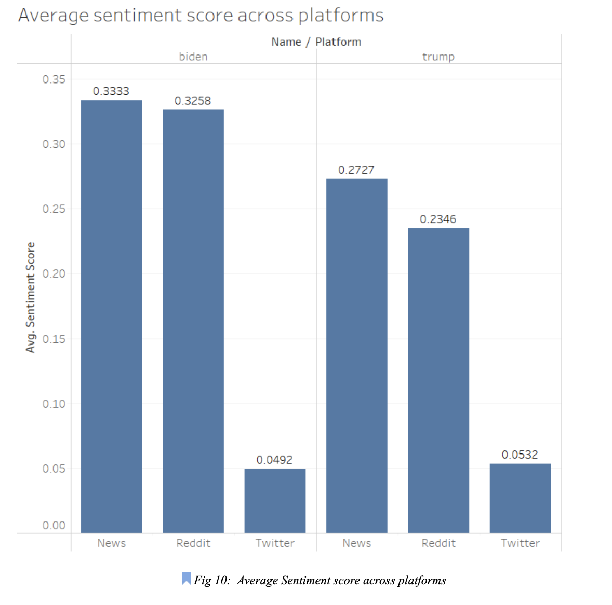
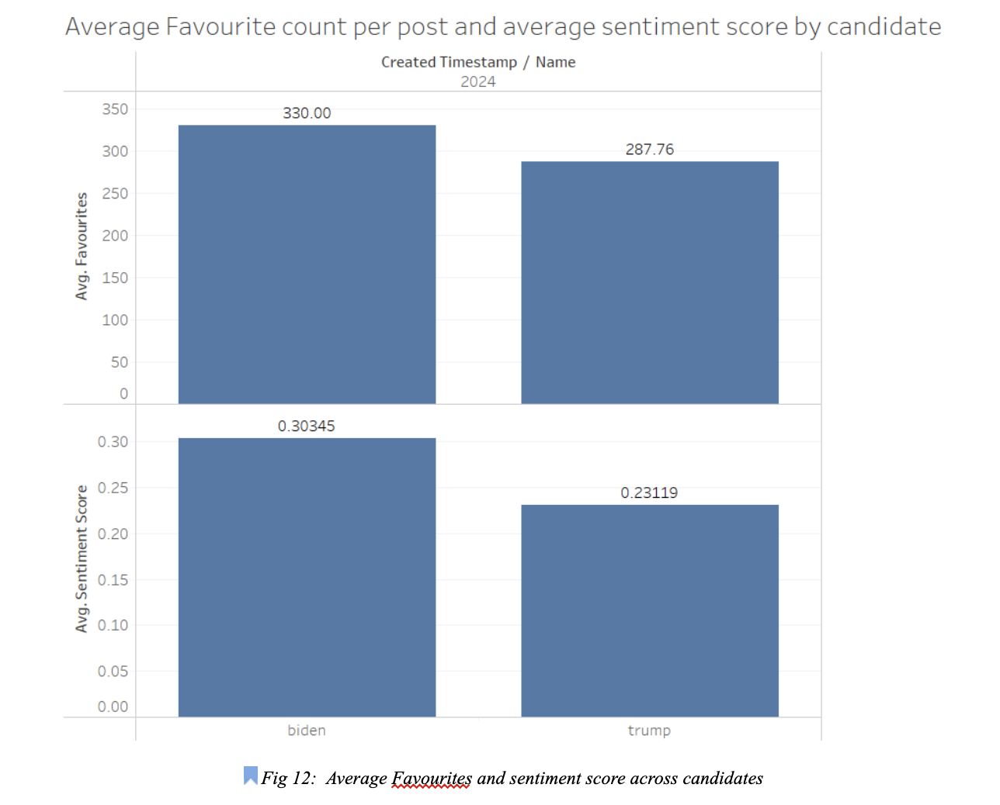
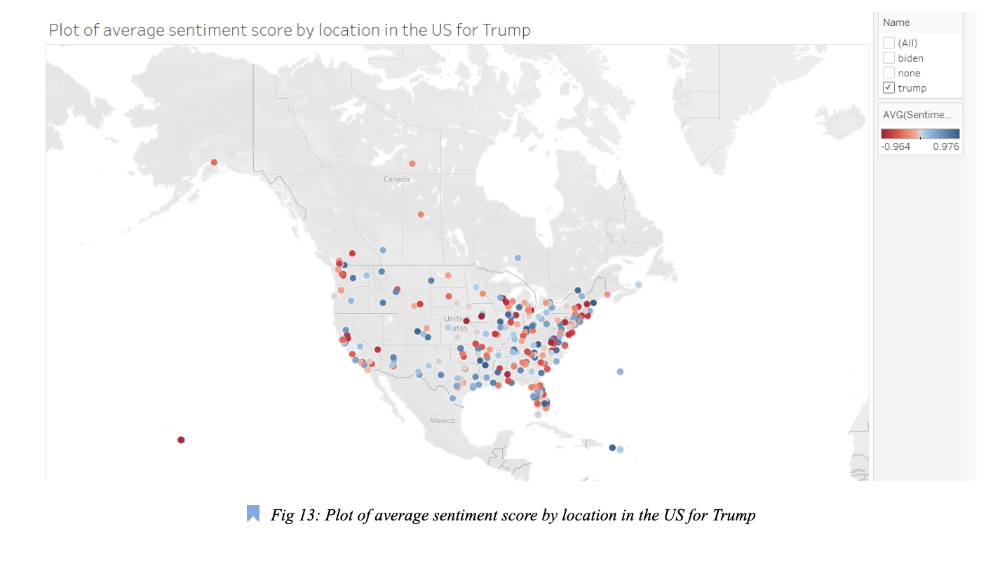
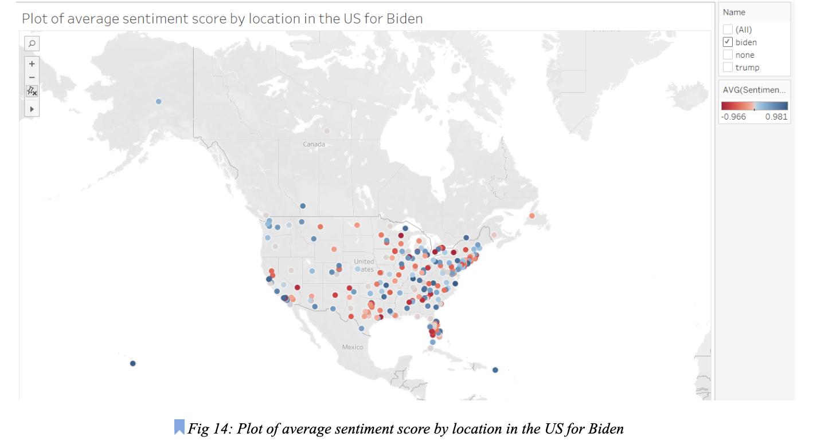
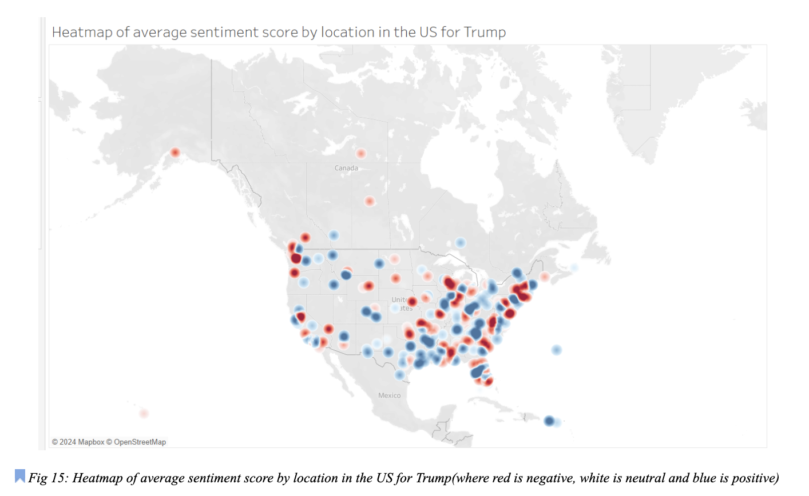
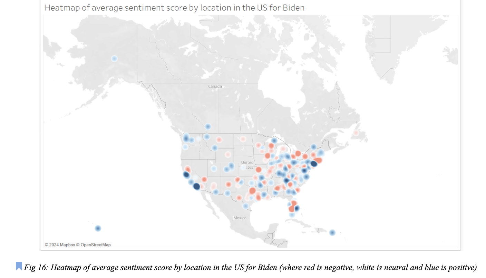
From Fig 9, we can see that the total favourites, posts and comment counts are relatively evenly distributed between Trump and Biden and the unclassified posts. Our models are able to classify 92.5% of the posts, which is important as it meaningfully allows us to classify most of the posts for further analysis
From the average sentiment score across platforms (Fig 10), we also noticed that both candidates scored highest for posts in news, followed closely by Reddit, while experiencing a significant drop off in sentiments for Twitter posts. This visualization further enforces the point that Biden is the preferred candidate as he holds a significant advantage in the sentiments on Reddit and the News.
rienced rises and falls in the average sentiment score at similar times (Fig 11). The week-on-week growth/decreases were almost identical in patterns between 14 Jan 24 to 11 Feb 24 and 17 Mar 24 to 21 Apr 24. This came as a surprise to us as one would expect that when Trump gains momentum, the sentiment towards Biden will become worse and vice-versa, but our visualizations have shown there seems to be a positive correlation between their average sentiment scores.
We observe that Biden is more popular than Trump. On each Biden post, his average favourite count per post is 333.0 compared to 287.8 for Trump. He also scores a higher average sentiment score of 0.3034 compared to 0.2312 of Trump. (Fig 12).
From the location plots and heatmap (Fig 13, 14, 15, 16 and 17), we can observe that the sentiments towards Biden in larger states held by the Democrats currently such as California, New York and Washington(capital of USA) are more positive than towards Trump. However, the sentiment towards Trump in states currently held by Republicans, notably states such as Texas continue to be more in favour of Trump than Biden. This is expected as it is generally common for one party to exert long term dominance over a given area or state.

From the heatmap(Fig 15, Fig 16),we can also see that trump generally experiences more extreme sentiments than biden with more extreme negatives denoted by the darker reds and more extreme positives denoted by darker blues, whereas the sentiment towards Biden tends to be milder in nature
